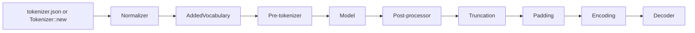

## At A Glance

| Area | Status | Notes |
|---|---:|---|
| MoonBit targets | Supported | `wasm`, `wasm-gc`, `js`, `native` |
| Core models | Supported | BPE, WordPiece, Unigram, WordLevel |
| Hub download | Native / JS | Optional `@hub` package; core loader remains offline/all-target |
| Verified fixtures | 39 models | GPT-2, RoBERTa, BERT, Llama, Qwen, DeepSeek, CLIP, embeddings and more |
| Regex strategy | Deterministic subset | Common HF patterns implemented; unsupported patterns fail explicitly |
| Batch parallel API | Compatibility aliases | Stable-order serial execution across targets today |

## Tokenizer Pipeline



## Common Entry Points

| Task | Start Here | API |
|---|---|---|
| Load a local tokenizer | [Loading Tokenizers](/tokenizers-moonbit/guide/loading.html) | `@tokenizer.from_file`, `Tokenizer::from_str` |
| Encode text or pairs | [Encoding and Decoding](/tokenizers-moonbit/guide/encoding-decoding.html) | `encode`, `encode_pair`, `encode_batch` |
| Migrate from Python | [From HuggingFace](/tokenizers-moonbit/migration/from-huggingface.html) | API mapping tables and semantic notes |
| Check component support | [Compatibility Overview](/tokenizers-moonbit/compatibility/overview.html) | Models, normalizers, pre-tokenizers and processors |
| Follow project status | [Development Status](/tokenizers-moonbit/development/status.html) | Milestones, tests and roadmap |

## Install

```bash
moon add howtomakeaname/tokenizers-moonbit
```

```moonbit
let tok = @tokenizer.Tokenizer::from_str(json_text)
let enc = tok.encode("Hello world")
println(enc.ids)
println(enc.tokens)
```
