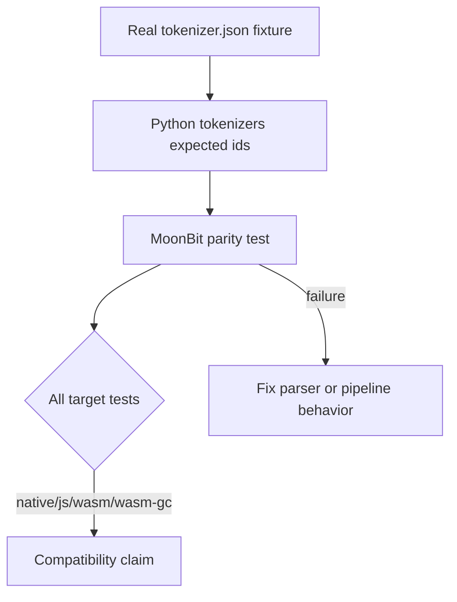

# Compatibility Overview

The goal is practical HuggingFace `tokenizers` compatibility across MoonBit
targets. The project prefers explicit errors over silent approximations.

## Compatibility Contract

| Area | Contract |
|---|---|
| Supported tokenizer.json components | Load and execute with HF-like semantics |
| Required JSON fields | Match HF parser strictness where implemented |
| Unsupported component types | Raise `UnsupportedComponent` |
| Unsupported regex features | Fail explicitly at load time when possible |
| Public API aliases | Provide typed MoonBit APIs plus Python-binding-friendly aliases |
| Backends | Keep core encode/decode portable across wasm, wasm-gc, js and native |

## Testing Strategy

Optional fixture tests self-skip when large model files are not present, while
inline tests always run in CI.
