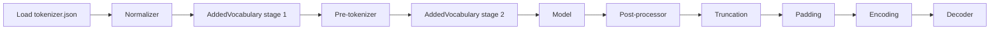

# Pipeline

The runtime follows the HuggingFace tokenizer pipeline while keeping each stage
explicit in MoonBit.

| Stage | Responsibility | Examples |
|---|---|---|
| Normalizer | Canonicalize text | Lowercase, NFKC, BertNormalizer |
| AddedVocabulary | Extract added/special tokens | `[MASK]`, `<|endoftext|>` |
| Pre-tokenizer | Split normalized text | ByteLevel, Whitespace, Split, Metaspace |
| Model | Map pieces to ids | BPE, WordPiece, Unigram, WordLevel |
| Post-processor | Add templates and metadata | BERT, RoBERTa, TemplateProcessing |
| Truncation | Enforce max length | LongestFirst, OnlyFirst, OnlySecond |
| Padding | Produce rectangular inputs | Fixed, BatchLongest |
| Decoder | Convert ids back to text | ByteLevel, WordPiece, Metaspace, CTC |

The `add_special_tokens` flag is post-processor specific: it controls injected
special tokens, not the entire post-processing stage. Non-special metadata and
offset transformations still run when the flag is false.
