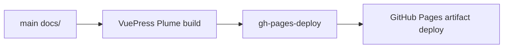

# Docs Workflow

The `main` branch owns the VuePress/Plume site source under `docs/`. This keeps
documentation changes next to code, tests and `PROGRESS.md` instead of requiring
a separate source branch.

## Local Commands

```bash
pnpm install --frozen-lockfile
pnpm docs:dev
pnpm docs:build
```

## Build Output

VuePress builds into `gh-pages-deploy/`. That directory is ignored locally and
uploaded by GitHub Actions as a Pages artifact.



## CI Flow

The `Pages` workflow runs on pushes to `main` that touch docs or site tooling:

1. Checkout `main`.
2. Install Node and `pnpm`.
3. Run `pnpm install --frozen-lockfile`.
4. Build `docs/` into `gh-pages-deploy/`.
5. Deploy the artifact through GitHub Pages.

## Bilingual Updates

English pages under `docs/` and Chinese pages under `docs/zh/` should stay
structurally aligned. When a change adds or updates user-facing behavior, API
surface, compatibility notes, migration guidance, performance claims or docs
site navigation, update both languages in the same change.

If a page intentionally has no translated counterpart, document that exception
in the change description. Otherwise, every main English page should have the
matching `/zh/` page at the same relative path.
