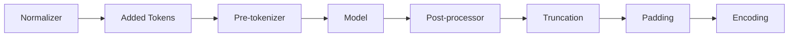

# Getting Started

`tokenizers-moonbit` is a pure MoonBit tokenizer runtime that loads standard
HuggingFace `tokenizer.json` files and compiles across MoonBit targets.

## Install

```bash
moon add howtomakeaname/tokenizers-moonbit
```

## Minimal Encode / Decode

```moonbit
let tok = @tokenizer.Tokenizer::from_str(json_text)
let enc = tok.encode("Hello world")

println(enc.ids)
println(enc.tokens)

let text = tok.decode(enc.ids, skip_special_tokens=true)
```

## Choose a Loader

| Input | API | Targets | Notes |
|---|---|---|---|
| JSON string | `Tokenizer::from_str` | all | Best for embedded assets or browser fetch |
| UTF-8 bytes | `Tokenizer::from_buffer` | all | Useful for host-provided buffers |
| Local file | `@tokenizer.from_file` | all | Reads `tokenizer.json` through `moonbitlang/x/fs` |
| Local/HF cache | `@tokenizer.from_pretrained` | all | Offline cache and local directory resolver |
| Online Hub | `@hub.from_pretrained` | native/js | Optional package with HTTP/cache support |

## What Is Implemented?

The core runtime covers the main HF pipeline:



Models include BPE, WordPiece, Unigram and WordLevel. See
[Component Matrix](/tokenizers-moonbit/compatibility/components/) for the
detailed support table and known limitations.
