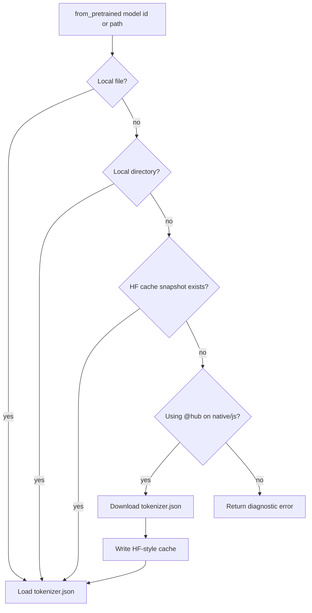

# Hub and Offline Cache

The core tokenizer package is offline by design. Online download is provided by
the optional `@hub` package on native and js targets.

## Resolution Flow



## Offline Core

```moonbit
let tok = @tokenizer.from_pretrained("bert-base-uncased")
```

The offline resolver can read local exports and standard HF cache snapshots.
This keeps wasm and wasm-gc builds independent from a network runtime.

## Online Hub Package

```moonbit
let opts = @hub.HubDownloadOptions::new(
  revision="main",
  endpoint="https://hf-mirror.com",
  cache_dir=Some(".hf-cache"),
)
let tok = @hub.from_pretrained("bert-base-uncased", options=opts)
```

| Feature | Status | Notes |
|---|---:|---|
| `tokenizer.json` GET | Supported | native/js |
| ETag/cache metadata | Supported | Cache freshness helpers |
| HEAD preflight | Supported | Used when cache is present |
| Resume/Range planning | Supported | Tokenizer JSON path |
| Fixed sidecars | Partial | `tokenizer_config.json`, `special_tokens_map.json` readers |
| Arbitrary sidecar parse | Planned | Raw sidecar cache bridge exists |

## Browser and Edge Runtimes

For browser-like runtimes, fetch the JSON in host code and pass the body to the
portable loader:

```moonbit
let tok = @tokenizer.Tokenizer::from_str(tokenizer_json)
```

This keeps credentials, CORS and streaming policy outside the tokenizer core.
