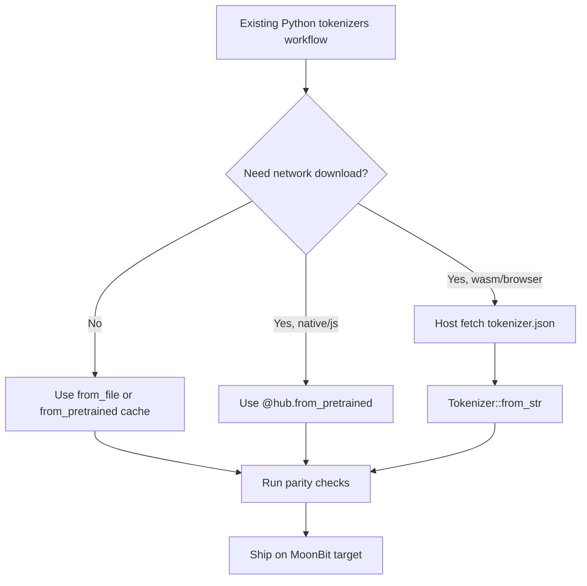

# From HuggingFace

Most migrations start from an existing `tokenizer.json`. Use that file directly
instead of converting it.

## Minimal Mapping

| Python tokenizers | MoonBit |
|---|---|
| `Tokenizer.from_file("tokenizer.json")` | `@tokenizer.from_file("tokenizer.json")` |
| `Tokenizer.from_str(json)` | `@tokenizer.Tokenizer::from_str(json)` |
| `tok.encode(text)` | `tok.encode(text)` |
| `tok.encode(text, add_special_tokens=False)` | `tok.encode(text, add_special_tokens=false)` |
| `tok.encode(a, b)` | `tok.encode_pair(a, b)` |
| `tok.encode_batch(texts)` | `tok.encode_batch(texts)` |
| `tok.decode(ids, skip_special_tokens=True)` | `tok.decode(ids, skip_special_tokens=true)` |

## Important Semantic Notes

`add_special_tokens=false` only suppresses post-processor-injected special
tokens. Template/BERT type ids, sequence ids and ByteLevel/RoBERTa offset
trimming still run.

MoonBit APIs use typed enums and `Option` values where Python often accepts
strings or `None`. HF-style string helper aliases are available for common
binding surfaces such as truncation and padding.

## Checklist

1. Load the same `tokenizer.json` in MoonBit.
2. Compare token ids for representative text, pair and pre-tokenized inputs.
3. Check offset expectations, especially for ByteLevel/RoBERTa or custom
   normalizers.
4. Enable truncation and padding from JSON or programmatic builders.
5. Run the target matrix you plan to ship: `native`, `js`, `wasm`, `wasm-gc`.
