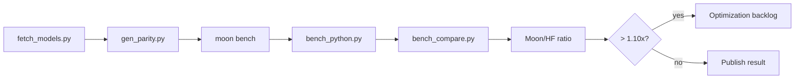

# Benchmarks

Benchmarks compare MoonBit encode/decode/load performance against Python
`tokenizers` on the same corpora.

## Summary

<BenchmarkSnapshot locale="en" />

## Charts

<BenchmarkChart src="/benchmarks/charts/ratio-bar.json" title="Moon/HF Ratio by Case" :height="350" />

<BenchmarkChart src="/benchmarks/charts/scatter.json" title="Moon µs vs HF µs" :height="400" />

<BenchmarkChart src="/benchmarks/charts/summary.json" title="Performance Distribution" :height="350" />

<BenchmarkChart src="/benchmarks/charts/model-bar.json" title="Average Ratio by Model" :height="350" />

## Pipeline



## Commands

```bash
python3 scripts/fetch_models.py
pip install tokenizers numpy
python3 scripts/gen_parity.py

moon bench --target native
python3 scripts/bench_compare.py --target native --corpus mixed
python3 scripts/bench_compare.py --target native --corpus all --fail-above 1.10

# Generate ECharts from benchmark report
node scripts/gen-bench-charts.mjs reports/bench-native-mixed.json
```

## Reading Results

| Moon/HF ratio | Interpretation |
|---:|---|
| `< 0.90x` | MoonBit is faster on this case |
| `0.90x .. 1.10x` | Same range |
| `> 1.10x` | Optimization candidate or regression |

Published performance claims should quote the comparison ratio, not standalone
`moon bench` output.

The page reads `/benchmarks/latest.json` at runtime. CI writes the raw
`reports/bench-native-mixed.json` artifact from `bench_compare.py --json-out`,
then the docs build converts that report into the static JSON consumed here.
ECharts are generated from the same report via `gen-bench-charts.mjs`.
