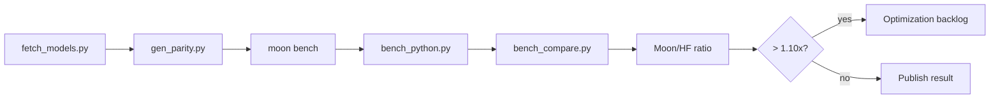

# Benchmarks

Benchmarks compare MoonBit encode/decode/load performance against Python
`tokenizers` on the same corpora.

## Charts

### Moon/HF Ratio by Case

::: echarts Moon/HF Ratio (Lower is Better)
```json
{
  "title": { "text": "MoonBit vs HuggingFace tokenizers", "subtext": "Moon/HF ratio - lower is faster", "left": "center" },
  "tooltip": { "trigger": "axis", "axisPointer": { "type": "shadow" }, "formatter": "{b}: {c}x" },
  "grid": { "left": "3%", "right": "10%", "bottom": "3%", "containLabel": true },
  "xAxis": { "type": "value", "name": "Moon/HF Ratio", "min": 0, "max": 1.0, "splitLine": { "lineStyle": { "type": "dashed" } }, "axisLabel": { "formatter": "{value}x" } },
  "yAxis": { "type": "category", "data": ["llama-encode", "gpt2-decode", "bert-decode", "llama-decode", "gpt2-encode", "bert-encode", "Qwen2.5-encode", "t5-encode", "bge-encode"], "axisLabel": { "fontSize": 11 } },
  "series": [{
    "type": "bar",
    "data": [
      { "value": 0.28, "itemStyle": { "color": "#22c55e" } },
      { "value": 0.13, "itemStyle": { "color": "#22c55e" } },
      { "value": 0.17, "itemStyle": { "color": "#22c55e" } },
      { "value": 0.35, "itemStyle": { "color": "#22c55e" } },
      { "value": 0.43, "itemStyle": { "color": "#22c55e" } },
      { "value": 0.53, "itemStyle": { "color": "#22c55e" } },
      { "value": 0.58, "itemStyle": { "color": "#22c55e" } },
      { "value": 0.39, "itemStyle": { "color": "#22c55e" } },
      { "value": 0.42, "itemStyle": { "color": "#22c55e" } }
    ],
    "label": { "show": true, "position": "right", "formatter": "{c}x", "fontSize": 11, "fontWeight": "bold" },
    "markLine": { "silent": true, "data": [{ "xAxis": 1, "lineStyle": { "color": "#ef4444", "type": "dashed", "width": 2 } }], "label": { "formatter": "1.0x (HF baseline)", "position": "end" } },
    "markPoint": { "data": [{ "type": "max", "label": { "formatter": "Slowest: {c}x" } }] }
  }]
}
```
:::

### Performance Summary

::: echarts Performance Distribution
```json
{
  "title": { "text": "Benchmark Results Distribution", "left": "center" },
  "tooltip": { "trigger": "item", "formatter": "{b}: {c} cases ({d}%)" },
  "legend": { "bottom": "5%", "left": "center" },
  "series": [{
    "type": "pie",
    "radius": ["40%", "70%"],
    "avoidLabelOverlap": true,
    "itemStyle": { "borderRadius": 6, "borderColor": "#fff", "borderWidth": 2 },
    "label": { "show": true, "formatter": "{b}\n{c} cases", "fontSize": 12 },
    "emphasis": { "label": { "show": true, "fontSize": 14, "fontWeight": "bold" } },
    "data": [
      { "value": 35, "name": "Faster (< 0.9x)", "itemStyle": { "color": "#22c55e" } },
      { "value": 4, "name": "Same Range (0.9-1.1x)", "itemStyle": { "color": "#f59e0b" } },
      { "value": 0, "name": "Slower (> 1.1x)", "itemStyle": { "color": "#ef4444" } }
    ]
  }]
}
```
:::

### Key Performance Metrics

::: echarts Performance Highlights
```json
{
  "title": { "text": "MoonBit Performance Highlights", "left": "center" },
  "tooltip": { "trigger": "axis", "axisPointer": { "type": "shadow" } },
  "grid": { "left": "3%", "right": "4%", "bottom": "3%", "containLabel": true },
  "xAxis": { "type": "value", "name": "Speedup Factor", "min": 0, "max": 8, "splitLine": { "lineStyle": { "type": "dashed" } }, "axisLabel": { "formatter": "{value}x faster" } },
  "yAxis": { "type": "category", "data": ["bert-decode", "llama-encode", "gpt2-decode", "llama-decode", "t5-encode", "bge-encode", "gpt2-encode", "Qwen2.5-encode", "bert-encode"], "axisLabel": { "fontSize": 11 } },
  "series": [{
    "type": "bar",
    "data": [
      { "value": 5.88, "itemStyle": { "color": "#22c55e" } },
      { "value": 3.57, "itemStyle": { "color": "#22c55e" } },
      { "value": 7.69, "itemStyle": { "color": "#22c55e" } },
      { "value": 2.86, "itemStyle": { "color": "#22c55e" } },
      { "value": 2.56, "itemStyle": { "color": "#22c55e" } },
      { "value": 2.38, "itemStyle": { "color": "#22c55e" } },
      { "value": 2.33, "itemStyle": { "color": "#22c55e" } },
      { "value": 1.72, "itemStyle": { "color": "#22c55e" } },
      { "value": 1.89, "itemStyle": { "color": "#22c55e" } }
    ],
    "label": { "show": true, "position": "right", "formatter": "{c}x faster", "fontSize": 11, "fontWeight": "bold" },
    "markLine": { "silent": true, "data": [{ "xAxis": 1, "lineStyle": { "color": "#9ca3af", "type": "dashed" } }], "label": { "formatter": "1x (same speed)" } }
  }]
}
```
:::

## Pipeline



## Commands

```bash
python3 scripts/fetch_models.py
pip install tokenizers numpy
python3 scripts/gen_parity.py

moon bench --target native
python3 scripts/bench_compare.py --target native --corpus mixed
python3 scripts/bench_compare.py --target native --corpus all --fail-above 1.10

# Generate ECharts from benchmark report
node scripts/gen-bench-charts.mjs reports/bench-native-mixed.json
```

## Reading Results

| Moon/HF ratio | Interpretation |
|---:|---|
| `< 0.90x` | MoonBit is faster on this case |
| `0.90x .. 1.10x` | Same range |
| `> 1.10x` | Optimization candidate or regression |

Published performance claims should quote the comparison ratio, not standalone
`moon bench` output.

The page reads `/benchmarks/latest.json` at runtime. CI writes the raw
`reports/bench-native-mixed.json` artifact from `bench_compare.py --json-out`,
then the docs build converts that report into the static JSON consumed here.
ECharts are generated from the same report via `gen-bench-charts.mjs`.
