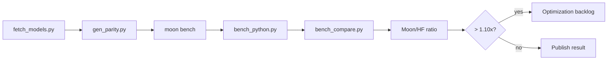

# Benchmarks

Benchmarks compare MoonBit encode/decode/load performance against Python
`tokenizers` on the same corpora.



## Commands

```bash
python3 scripts/fetch_models.py
pip install tokenizers numpy
python3 scripts/gen_parity.py

moon bench --target native
python3 scripts/bench_compare.py --target native --corpus mixed
python3 scripts/bench_compare.py --target native --corpus all --fail-above 1.10
```

## Reading Results

| Moon/HF ratio | Interpretation |
|---:|---|
| `< 0.90x` | MoonBit is faster on this case |
| `0.90x .. 1.10x` | Same range |
| `> 1.10x` | Optimization candidate or regression |

Published performance claims should quote the comparison ratio, not standalone
`moon bench` output.
