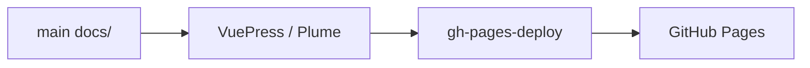

# tokenizers-moonbit 中文文档

`tokenizers-moonbit` 是 HuggingFace `tokenizers` 的 MoonBit 实现，目标是在
`wasm`、`wasm-gc`、`js`、`native` 等 MoonBit target 上直接加载标准
`tokenizer.json` 并执行 encode/decode。

## 快速入口

| 主题 | 链接 | 内容 |
|---|---|---|
| 英文指南 | [Get Started](/tokenizers-moonbit/guide/getting-started/) | 结构化指南与图表 |
| 中文使用指南 | [Usage](/tokenizers-moonbit/zh/usage/) | 加载、编码、padding/truncation |
| 中文 API | [API](/tokenizers-moonbit/zh/api/) | 完整签名说明 |
| 组件与限制 | [Components](/tokenizers-moonbit/zh/components/) | 支持矩阵和已知边界 |
| 迁移指南 | [Migration](/tokenizers-moonbit/zh/migration-from-hf/) | 从 HuggingFace 迁移 |

## 核心能力

- 纯 MoonBit 实现，无原生 addon。
- 支持 BPE、WordPiece、Unigram、WordLevel。
- 支持常见 normalizer、pre-tokenizer、post-processor、decoder。
- 可选 `@hub` 包支持 native/js 在线下载，核心包保持离线和全 target 可用。
- 文档源码直接维护在 main 分支 `docs/` 目录，GitHub Actions 构建到 `gh-pages-deploy/` 并发布。

