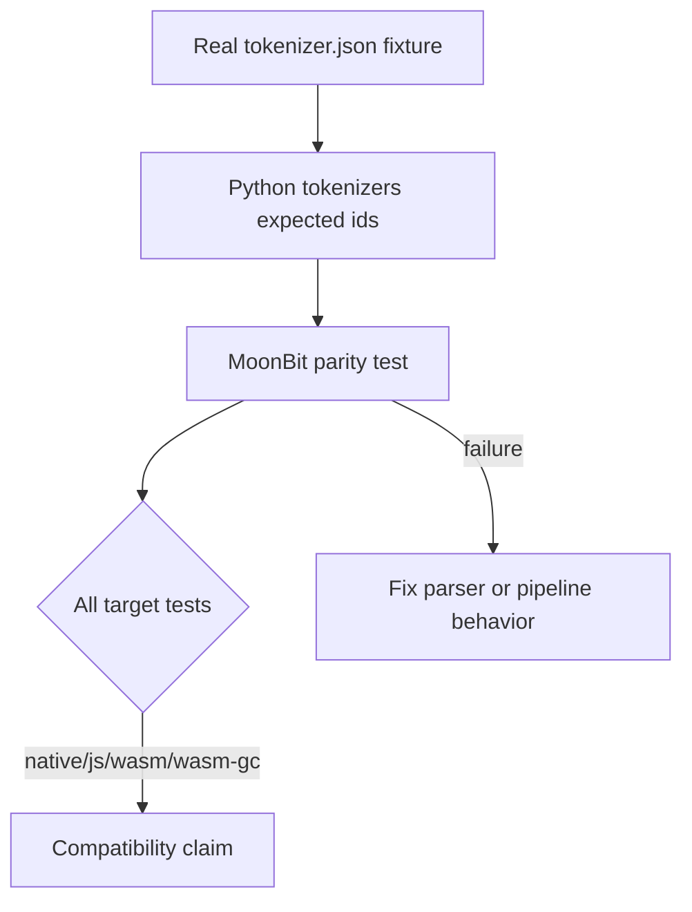

# Compatibility Overview

目标是在 MoonBit 各 target 上提供实用的 HuggingFace `tokenizers` 兼容性。
项目优先选择显式报错，而不是静默近似。

## Compatibility Contract

| 范围 | 契约 |
|---|---|
| 支持的 tokenizer.json 组件 | 以 HF 近似语义加载并执行 |
| 必需 JSON 字段 | 在已实现范围内匹配 HF parser 严格度 |
| 不支持的组件类型 | 抛出 `UnsupportedComponent` |
| 不支持的 regex 特性 | 尽可能在加载时显式失败 |
| 公开 API aliases | 提供 typed MoonBit API 以及便于 Python binding 的 aliases |
| Backends | 保持核心 encode/decode 可移植到 wasm、wasm-gc、js 和 native |

## Testing Strategy

可选 fixture 测试会在大型模型文件不存在时自动跳过，而 inline 测试始终在 CI 中运行。
