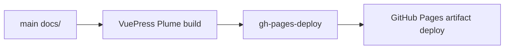

# Docs Workflow

`main` 分支承载 `docs/` 下的 VuePress/Plume 站点源码。这样文档变更能与代码、测试和 `PROGRESS.md` 放在一起，不需要单独的源码分支。

## Local Commands

```bash
pnpm install --frozen-lockfile
pnpm docs:dev
pnpm docs:build
```

## Build Output

VuePress 会构建到 `gh-pages-deploy/`。该目录在本地被忽略，并由 GitHub Actions 作为 Pages artifact 上传。



## CI Flow

当推送到 `main` 且变更触及文档或站点工具时，`Pages` workflow 会运行：

1. Checkout `main`。
2. 安装 Node 和 `pnpm`。
3. 运行 `pnpm install --frozen-lockfile`。
4. 将 `docs/` 构建到 `gh-pages-deploy/`。
5. 通过 GitHub Pages 部署 artifact。

## 双语同步

`docs/` 下的英文页面和 `docs/zh/` 下的中文页面应保持结构对齐。涉及用户可见行为、
API 面、兼容性说明、迁移指南、性能结论或文档站导航的变更，需要在同一次变更里同步
更新英文和中文文档。

如果某个页面明确不需要翻译，需要在变更说明中写清例外原因。否则，每个主要英文页面
都应在 `/zh/` 下拥有相同相对路径的中文对应页。
