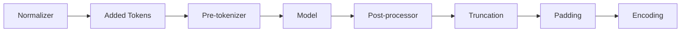

# 快速开始

`tokenizers-moonbit` 是纯 MoonBit tokenizer 运行时，可加载标准
HuggingFace `tokenizer.json` 文件，并编译到各 MoonBit target。

## 安装

```bash
moon add howtomakeaname/tokenizers-moonbit
```

## 最小 Encode / Decode

```moonbit
let tok = @tokenizer.Tokenizer::from_str(json_text)
let enc = tok.encode("Hello world")

println(enc.ids)
println(enc.tokens)

let text = tok.decode(enc.ids, skip_special_tokens=true)
```

## 选择加载方式

| 输入 | API | Targets | 说明 |
|---|---|---|---|
| JSON 字符串 | `Tokenizer::from_str` | all | 适合内嵌资源或浏览器 fetch |
| UTF-8 字节 | `Tokenizer::from_buffer` | all | 适合宿主传入的 buffer |
| 本地文件 | `@tokenizer.from_file` | all | 通过 `moonbitlang/x/fs` 读取 `tokenizer.json` |
| 本地/HF cache | `@tokenizer.from_pretrained` | all | 离线 cache 与本地目录解析 |
| 在线 Hub | `@hub.from_pretrained` | native/js | 可选包，支持 HTTP/cache |

## 已实现内容

核心运行时覆盖 HF 的主要 pipeline：



模型包括 BPE、WordPiece、Unigram 和 WordLevel。详细支持表和已知限制见
[组件矩阵](/tokenizers-moonbit/zh/compatibility/components/)。
