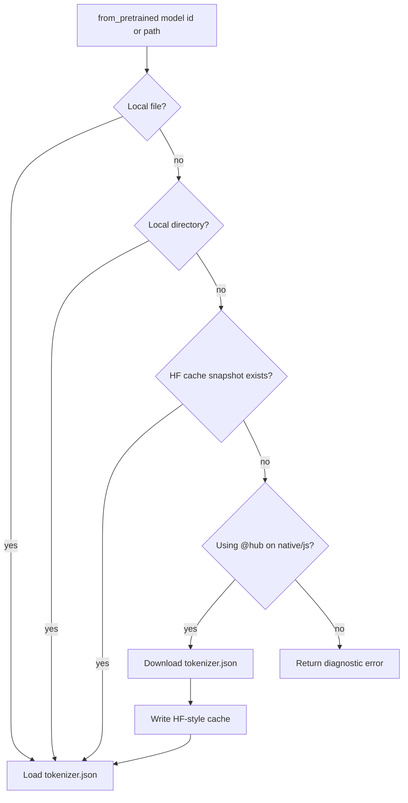

# Hub 与离线 Cache

核心 tokenizer 包按离线设计。native 和 js target 上的在线下载由可选 `@hub` 包提供。

## 解析流程



## 离线核心包

```moonbit
let tok = @tokenizer.from_pretrained("bert-base-uncased")
```

离线解析器可以读取本地导出和标准 HF cache snapshot。这让 wasm 与 wasm-gc 构建不依赖网络运行时。

## 在线 Hub 包

```moonbit
let opts = @hub.HubDownloadOptions::new(
  revision="main",
  endpoint="https://hf-mirror.com",
  cache_dir=Some(".hf-cache"),
)
let tok = @hub.from_pretrained("bert-base-uncased", options=opts)
```

| 功能 | 状态 | 说明 |
|---|---:|---|
| `tokenizer.json` GET | 支持 | native/js |
| ETag/cache metadata | 支持 | Cache freshness helper |
| HEAD preflight | 支持 | cache 存在时使用 |
| Resume/Range planning | 支持 | Tokenizer JSON 路径 |
| 固定 sidecar | 部分支持 | `tokenizer_config.json`, `special_tokens_map.json` reader |
| 任意 sidecar 解析 | 计划中 | 已有 raw sidecar cache bridge |

## Browser 与 Edge 运行时

对于类浏览器运行时，在宿主代码中 fetch JSON，并将响应 body 传给可移植加载器：

```moonbit
let tok = @tokenizer.Tokenizer::from_str(tokenizer_json)
```

这样可以把凭证、CORS 和 streaming 策略留在 tokenizer core 之外。
