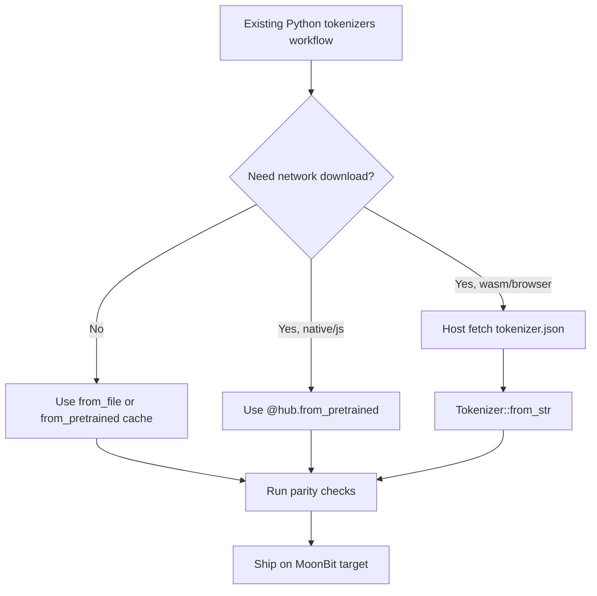

# From HuggingFace

多数迁移都从已有的 `tokenizer.json` 开始。优先直接使用这个文件，不需要再做格式转换。

## Minimal Mapping

| Python tokenizers | MoonBit |
|---|---|
| `Tokenizer.from_file("tokenizer.json")` | `@tokenizer.from_file("tokenizer.json")` |
| `Tokenizer.from_str(json)` | `@tokenizer.Tokenizer::from_str(json)` |
| `tok.encode(text)` | `tok.encode(text)` |
| `tok.encode(text, add_special_tokens=False)` | `tok.encode(text, add_special_tokens=false)` |
| `tok.encode(a, b)` | `tok.encode_pair(a, b)` |
| `tok.encode_batch(texts)` | `tok.encode_batch(texts)` |
| `tok.decode(ids, skip_special_tokens=True)` | `tok.decode(ids, skip_special_tokens=true)` |

## Important Semantic Notes

`add_special_tokens=false` 只会跳过后处理器注入的特殊 token。模板/BERT 类型 id、序列 id，以及 ByteLevel/RoBERTa 的 offset 裁剪仍会执行。

MoonBit API 在 Python 常用字符串或 `None` 的地方使用带类型的枚举和 `Option` 值。针对截断、填充等常见绑定入口，也提供了 HF 风格的字符串辅助别名。

## Checklist

1. 在 MoonBit 中加载同一个 `tokenizer.json`。
2. 对代表性的文本、文本对和预分词输入比较 token id。
3. 检查 offset 预期，尤其是 ByteLevel/RoBERTa 或自定义 normalizer 场景。
4. 从 JSON 或程序化构建器启用截断与填充。
5. 跑一遍计划发布的目标矩阵：`native`、`js`、`wasm`、`wasm-gc`。
