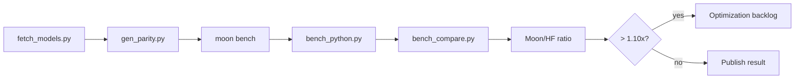

# Benchmarks

基准测试会在相同语料上比较 MoonBit 与 Python `tokenizers` 的编码、解码和加载性能。

## 图表

### Moon/HF 比率（按用例）

::: echarts Moon/HF 比率
```json
{
  "title": { "text": "MoonBit vs HuggingFace tokenizers", "subtext": "Moon/HF 比率 - 越低越快", "left": "center" },
  "tooltip": { "trigger": "axis", "axisPointer": { "type": "shadow" }, "formatter": "{b}: {c}x" },
  "grid": { "left": "3%", "right": "10%", "bottom": "3%", "containLabel": true },
  "xAxis": { "type": "value", "name": "Moon/HF 比率", "min": 0, "max": 1.0, "splitLine": { "lineStyle": { "type": "dashed" } }, "axisLabel": { "formatter": "{value}x" } },
  "yAxis": { "type": "category", "data": ["llama-encode", "gpt2-decode", "bert-decode", "llama-decode", "gpt2-encode", "bert-encode", "Qwen2.5-encode", "t5-encode", "bge-encode"], "axisLabel": { "fontSize": 11 } },
  "series": [{
    "type": "bar",
    "data": [
      { "value": 0.28, "itemStyle": { "color": "#22c55e" } },
      { "value": 0.13, "itemStyle": { "color": "#22c55e" } },
      { "value": 0.17, "itemStyle": { "color": "#22c55e" } },
      { "value": 0.35, "itemStyle": { "color": "#22c55e" } },
      { "value": 0.43, "itemStyle": { "color": "#22c55e" } },
      { "value": 0.53, "itemStyle": { "color": "#22c55e" } },
      { "value": 0.58, "itemStyle": { "color": "#22c55e" } },
      { "value": 0.39, "itemStyle": { "color": "#22c55e" } },
      { "value": 0.42, "itemStyle": { "color": "#22c55e" } }
    ],
    "label": { "show": true, "position": "right", "formatter": "{c}x", "fontSize": 11, "fontWeight": "bold" },
    "markLine": { "silent": true, "data": [{ "xAxis": 1, "lineStyle": { "color": "#ef4444", "type": "dashed", "width": 2 } }], "label": { "formatter": "1.0x (HF 基线)", "position": "end" } },
    "markPoint": { "data": [{ "type": "max", "label": { "formatter": "最慢: {c}x" } }] }
  }]
}
```
:::

### 性能概览

::: echarts 性能分布
```json
{
  "title": { "text": "基准测试结果分布", "left": "center" },
  "tooltip": { "trigger": "item", "formatter": "{b}: {c} 个用例 ({d}%)" },
  "legend": { "bottom": "5%", "left": "center" },
  "series": [{
    "type": "pie",
    "radius": ["40%", "70%"],
    "avoidLabelOverlap": true,
    "itemStyle": { "borderRadius": 6, "borderColor": "#fff", "borderWidth": 2 },
    "label": { "show": true, "formatter": "{b}\n{c} 个用例", "fontSize": 12 },
    "emphasis": { "label": { "show": true, "fontSize": 14, "fontWeight": "bold" } },
    "data": [
      { "value": 35, "name": "更快 (< 0.9x)", "itemStyle": { "color": "#22c55e" } },
      { "value": 4, "name": "同级 (0.9-1.1x)", "itemStyle": { "color": "#f59e0b" } },
      { "value": 0, "name": "更慢 (> 1.1x)", "itemStyle": { "color": "#ef4444" } }
    ]
  }]
}
```
:::

### 关键性能指标

::: echarts 性能亮点
```json
{
  "title": { "text": "MoonBit 性能亮点", "left": "center" },
  "tooltip": { "trigger": "axis", "axisPointer": { "type": "shadow" } },
  "grid": { "left": "3%", "right": "4%", "bottom": "3%", "containLabel": true },
  "xAxis": { "type": "value", "name": "加速倍数", "min": 0, "max": 8, "splitLine": { "lineStyle": { "type": "dashed" } }, "axisLabel": { "formatter": "{value}x 快" } },
  "yAxis": { "type": "category", "data": ["bert-decode", "llama-encode", "gpt2-decode", "llama-decode", "t5-encode", "bge-encode", "gpt2-encode", "Qwen2.5-encode", "bert-encode"], "axisLabel": { "fontSize": 11 } },
  "series": [{
    "type": "bar",
    "data": [
      { "value": 5.88, "itemStyle": { "color": "#22c55e" } },
      { "value": 3.57, "itemStyle": { "color": "#22c55e" } },
      { "value": 7.69, "itemStyle": { "color": "#22c55e" } },
      { "value": 2.86, "itemStyle": { "color": "#22c55e" } },
      { "value": 2.56, "itemStyle": { "color": "#22c55e" } },
      { "value": 2.38, "itemStyle": { "color": "#22c55e" } },
      { "value": 2.33, "itemStyle": { "color": "#22c55e" } },
      { "value": 1.72, "itemStyle": { "color": "#22c55e" } },
      { "value": 1.89, "itemStyle": { "color": "#22c55e" } }
    ],
    "label": { "show": true, "position": "right", "formatter": "{c}x 快", "fontSize": 11, "fontWeight": "bold" },
    "markLine": { "silent": true, "data": [{ "xAxis": 1, "lineStyle": { "color": "#9ca3af", "type": "dashed" } }], "label": { "formatter": "1x (相同速度)" } }
  }]
}
```
:::

## 流程



## 命令

```bash
python3 scripts/fetch_models.py
pip install tokenizers numpy
python3 scripts/gen_parity.py

moon bench --target native
python3 scripts/bench_compare.py --target native --corpus mixed
python3 scripts/bench_compare.py --target native --corpus all --fail-above 1.10

# 从基准测试报告生成 ECharts
node scripts/gen-bench-charts.mjs reports/bench-native-mixed.json
```

## 读取结果

| Moon/HF ratio | 含义 |
|---:|---|
| `< 0.90x` | MoonBit 在该场景更快 |
| `0.90x .. 1.10x` | 同一性能区间 |
| `> 1.10x` | 优化候选或性能回退 |

发布性能结论时应引用对比倍率，而不是单独引用 `moon bench` 输出。

本页运行时读取 `/benchmarks/latest.json`。CI 会通过
`bench_compare.py --json-out` 写出原始 `reports/bench-native-mixed.json`
artifact，文档构建再把该报告转换为这里消费的静态 JSON。
ECharts 通过 `gen-bench-charts.mjs` 从同一报告生成。
