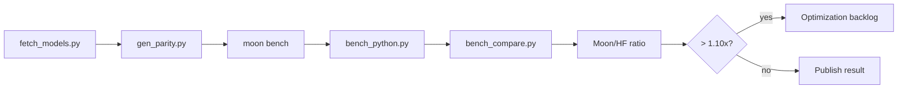

# Benchmarks

基准测试会在相同语料上比较 MoonBit 与 Python `tokenizers` 的编码、解码和加载性能。

## 概览

<BenchmarkSnapshot locale="zh" />

## 图表

<BenchmarkChart src="/benchmarks/charts/ratio-bar.json" title="Moon/HF 比率（按用例）" :height="350" />

<BenchmarkChart src="/benchmarks/charts/scatter.json" title="Moon µs vs HF µs 散点图" :height="400" />

<BenchmarkChart src="/benchmarks/charts/summary.json" title="性能分布" :height="350" />

<BenchmarkChart src="/benchmarks/charts/model-bar.json" title="按模型平均比率" :height="350" />

## 流程



## 命令

```bash
python3 scripts/fetch_models.py
pip install tokenizers numpy
python3 scripts/gen_parity.py

moon bench --target native
python3 scripts/bench_compare.py --target native --corpus mixed
python3 scripts/bench_compare.py --target native --corpus all --fail-above 1.10

# 从基准测试报告生成 ECharts
node scripts/gen-bench-charts.mjs reports/bench-native-mixed.json
```

## 读取结果

| Moon/HF ratio | 含义 |
|---:|---|
| `< 0.90x` | MoonBit 在该场景更快 |
| `0.90x .. 1.10x` | 同一性能区间 |
| `> 1.10x` | 优化候选或性能回退 |

发布性能结论时应引用对比倍率，而不是单独引用 `moon bench` 输出。

本页运行时读取 `/benchmarks/latest.json`。CI 会通过
`bench_compare.py --json-out` 写出原始 `reports/bench-native-mixed.json`
artifact，文档构建再把该报告转换为这里消费的静态 JSON。
ECharts 通过 `gen-bench-charts.mjs` 从同一报告生成。
